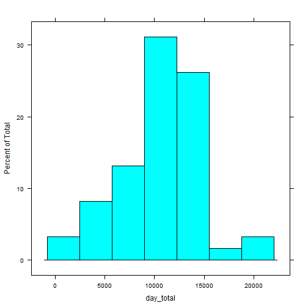
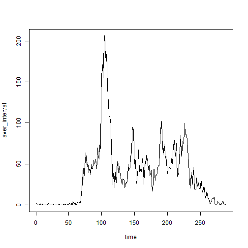
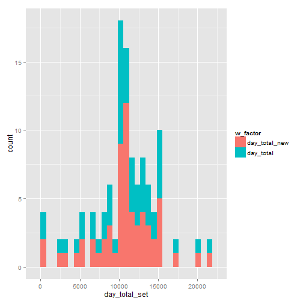
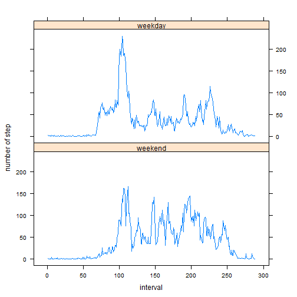

## Loading and preprocessing the data

```r
data_load<-read.csv("activity.csv")
data_date<-as.Date(data_load$date, "%Y-%m-%d") #convert to date
date_byday<-unique(data_date) #unique day
steps_record<-data_load$steps 
```

## What is mean total number of steps taken per day?

```r
num_day<-length(date_byday)
day_total=c(1:num_day)
for (i in 1:length(date_byday)){
           day_total[i]<-sum(steps_record[data_date==date_byday[i]])     
}

day_mean<-mean(day_total,na.rm=TRUE)
day_median<-median(day_total,na.rm=TRUE)
```
### Histogram of the total number of steps taken each day

```r
library("lattice")

histogram(day_total)
```

 


### The mean total number of steps taken per day is:

```r
print(day_mean)
```

```
## [1] 10766.19
```
### The median total number of steps taken per day is:

```r
print(day_median)
```

```
## [1] 10765
```


## What is the average daily activity pattern?

```r
day_aver<-function(date_byday,steps_record,data_date) {
interval<-c(1:length(date_byday))
aver_interval<-c(1:288)
for (j in 1:288) {
        for (i in 1:length(date_byday)) {
                   interval[i]<-steps_record[data_date==date_byday[i]][j]
        }
        aver_interval[j]<-mean(interval,na.rm=TRUE)
}
return (aver_interval)
}

aver_interval<-day_aver(date_byday,steps_record,data_date)
time<-c(1:288)
```

### The average daily activity pattern is:

```r
plot(time,aver_interval,"l")
```

 


## Imputing missing values
### use the mean for that 5-minute interval

```r
steps_record_copy<-steps_record
miss_num <- sum(is.na(data_load$steps))

for (j in 1:288) {
        for (i in 1:length(date_byday)) {
                   if (is.na(steps_record[data_date==date_byday[i]][j])) steps_record_copy[data_date==date_byday[i]][j]=aver_interval[j]
        }
}

num_day<-length(date_byday)
day_total_new=c(1:num_day)
for (i in 1:length(date_byday)){
           day_total_new[i]<-sum(steps_record_copy[data_date==date_byday[i]])     

}
day_mean_new<-mean(day_total_new,na.rm=TRUE)
day_median_new<-median(day_total_new,na.rm=TRUE)
```

### The mean total number of steps taken per day is(Imputing missing values):


```r
print(day_mean_new)
```

```
## [1] 10766.19
```

### The median total number of steps taken per day is(Imputing missing values):


```r
print(day_median_new)
```

```
## [1] 10766.19
```
### After imputing missing values, the mean total number of steps taken per day is the same, but the median total number of steps taken per day is different.

### Comparing the histogram of the total number of steps taken each day


```r
library(ggplot2)
day_total_set<-c(day_total_new,day_total)

w_factor <- rep(0:1, each = length(day_total_new))
w_factor <-factor(w_factor,labels=c("day_total_new","day_total"))
data_day_total<-data.frame(day_total_set,w_factor)
qplot(day_total_set,data=data_day_total,fill=w_factor)
```

```
## stat_bin: binwidth defaulted to range/30. Use 'binwidth = x' to adjust this.
```

 


## Are there differences in activity patterns between weekdays and weekends?

```r
weekend_set=weekdays(data_date)=="星期日"|weekdays(data_date)=="星期六"
weekday_set=weekdays(data_date)!="星期日"&weekdays(data_date)!="星期六"

weekends_data<-steps_record_copy[weekend_set]
weekends_time<-data_date[weekend_set]

weekdays_data<-steps_record_copy[weekday_set]
weekdays_time<-data_date[weekday_set]

weekends_byday<-unique(weekends_time)
weekdays_byday<-unique(weekdays_time)

aver_interval_weekends<-day_aver(date_byday=weekends_byday,steps_record=weekends_data,data_date=weekends_time)

aver_interval_weekdays<-day_aver(date_byday=weekdays_byday,steps_record=weekdays_data,data_date=weekdays_time)

interval<-c(1:288)


number_step<-c(aver_interval_weekends,aver_interval_weekdays)

f_factor <- rep(0:1, each = 288)
f_factor <-factor(f_factor,labels=c("weekend","weekday"))

xyplot(number_step ~ rep(interval,2) | f_factor, layout = c(1, 2),xlab="interval",ylab="number of step",type="l")
```

 


